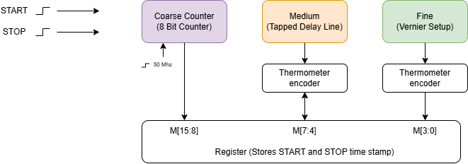
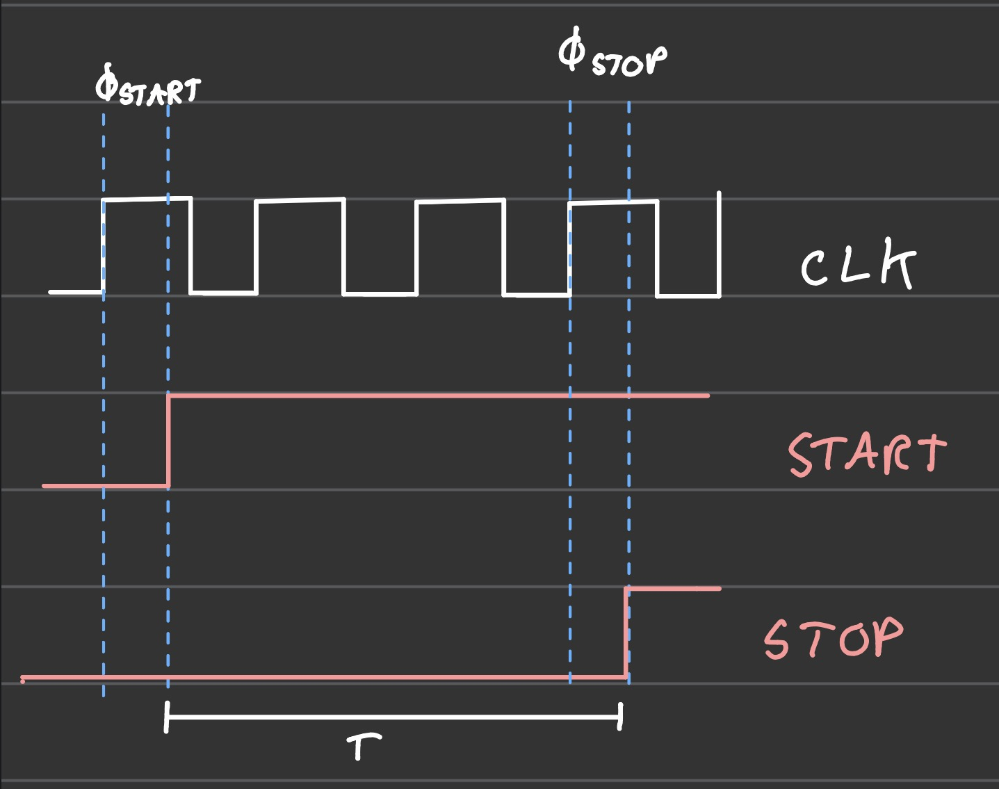
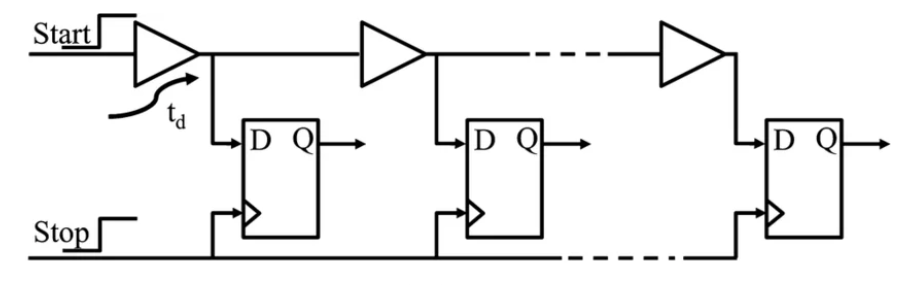

# Three-Stage Time-to-Digital Converter Proposal

## 1 Statement of purpose

We propose to design a time-to-digital converter (TDC) that measures the interval between the rising edges of external START and STOP signals. Our target is approximately **200 ps resolution** with a **50 MHz reference clock** and a target dynamic range of **5.12 µs**, with a 16-bit result read through an 8-bit multiplexed output bus. Here, dynamic range means the START-to-STOP measurement span. The 8-bit coarse counter gives this span from 256 clock periods of 20 ns each, as derived below.

The design will combine three measurement scales: an 8-bit reference-clock counter, a medium tapped delay line built from PDK standard cells, and a fine Vernier delay line using custom delay cells. We will implement the control, encoding, arithmetic, and readout in Verilog, and characterize the timing-sensitive circuits through transistor-level and extracted-layout simulation. The baseline design will operate without a DLL. A dual delay-locked loop (DLL) is an optional extension if the baseline passes verification with sufficient time and area remaining.

## 2 System diagram and operation

### Coarse timing and asynchronous event capture

The shared 8-bit counter runs continuously from the reference clock. Each endpoint captures a coarse timestamp and its position within the corresponding clock period. We will use a registered Gray-coded count or an equivalent coherent capture scheme, together with explicit coarse/fraction alignment. Gray coding alone does not resolve which clock cycle contains an event at the boundary.

Let N be the difference between the corrected coarse timestamps. Each phi term is the elapsed time from that event's preceding reference edge. The interval is:

$$
T = N T_{clk} + \phi_{STOP} - \phi_{START}
$$

This endpoint subtraction accounts for the two asynchronous phases relative to the reference clock. Simply synchronizing both edges before starting and stopping a counter would discard their sub-clock timing. Synchronizers will be used for captured-data handshakes and control; the timing front end must preserve the original edges. [2]

The medium and fine stages determine $\phi_{START}$ and $\phi_{STOP}$ for this subtraction.

### Medium tapped delay line

The medium stage uses a tapped delay line and a 4-bit timing code, allowing up to 16 timing regions within one reference clock period. A transition is launched through the delay chain, and the tap outputs are sampled to determine how far the transition has propagated. These outputs form a thermometer code, which is then encoded into the medium timing value. The actual region widths and number of useful taps will follow delay-cell characterization.

The launch and reset logic must ensure that only one relevant transition is present in the delay line during each measurement. Feeding a continuous square wave directly into the chain could create multiple rising and falling transitions, which would prevent the taps from forming a clean thermometer code.

The proposed PDK cell is **`gf180mcu_fd_sc_mcu9t5v0__dlyc_1` (DLYC_X1)**, with an approximate **1.3–1.4 ns** delay. Its documentation lists 1.3304 ns for a rising transition and 1.4221 ns for a falling transition at 0.0100 ns input slew and 0.0010 pF output load. These are different transition conditions, not a guaranteed delay range across process corners. Placement constraints will keep the delay cells physically arranged as intended. [3]

The final number of delay cells will be determined through characterization under the expected supply voltage, loading, input slew, and process corners. Sixteen equal regions in a 20 ns clock period would each be 1.25 ns, so the proposed PDK delay cannot simply be assumed to match that ideal division. The tap selection, final region, and coarse/fraction alignment must account for the actual delays and provide complete period coverage. [3]

It would look something like this where START is the reference clock rising edge and STOP is a START/STOP signal (we would be taking snapshots of both then subtracting).

Source: https://www.researchgate.net/figure/a-Delay-line-based-TDC-and-b-Vernier-TDC_fig1_325577699

### Residue generation and fine Vernier conversion

The fine stage measures the time remaining inside the selected medium region. For each endpoint, a **residue generator** must produce two physical edges separated by that residual interval. A thermometer encoder alone does not produce those edges. The circuit must preserve or delay the relevant event and tap edges long enough for selection, with matched path delays and verified timing at region boundaries.

The earlier residue edge enters the slower Vernier line and the later edge enters the faster line. Sampling at corresponding taps identifies where the faster edge catches the slower one. A thermometer-to-binary encoder then produces the fine code. The nominal resolution is the **difference** between the two per-stage delays:

$$
T_{fine} = \epsilon = \tau_{slow} - \tau_{fast} \approx 200\,\text{ps} > 0
$$

The fine result occupies a 4-bit field, allowing up to 16 codes; this does not require 16 equally spaced bins within every medium region. At a 200 ps delay difference, covering a 1.3–1.4 ns residue requires approximately seven effective comparison stages, plus any guard stages justified by corner simulations. The encoder must distinguish a valid end bin from no catch-up or over-range; physical tap count and 4-bit output width are not interchangeable. [2]

Custom fine cells will be designed and simulated at transistor level, laid out, checked with DRC and LVS, and characterized after parasitic extraction. The initial cell will use fixed sizing or a defined static bias. A voltage-controlled variant can support the DLL extension. Verilog delay statements are suitable for behavioral models, but do not implement a physical delay cell in silicon.

### Thermometer encoding and result assembly

The medium and fine encoders will include a defined response to all-zero, all-one, and isolated bubble patterns. Invalid patterns will raise ERROR instead of silently producing a plausible measurement. Bubble handling will be verified separately from metastability settling; an encoder cannot eliminate metastability by itself. [4]

The arithmetic block subtracts the two endpoint timestamps and handles borrow, carry, and counter wrap before latching the result. Wider internal arithmetic prevents intermediate overflow. An elapsed-time watchdog and explicit wrap tracking must reject intervals outside the supported range before modulo timestamp subtraction can alias them to a shorter interval. The watchdog must allow valid intervals up to the characterized full-scale boundary near 256 reference periods; a 128-period timeout would allow only 2.56 µs at 50 MHz. Its exact threshold and boundary handling will be verified together with coarse/fraction alignment. A separate conversion watchdog will use a bound established by timing simulation. The output fields describe the **normalized interval**, not a direct concatenation of one endpoint's raw tap codes.

## 3 IO pin assignment and readout

The byte-select signal **SEL** uses `ui_in[2]`. These are logical Tiny Tapeout project ports. Board connector and package pin numbers depend on the GF26c hardware. The `uio` pins have separate `uio_in`, `uio_out`, and `uio_oe` signals inside the RTL wrapper. [5]

| Tiny Tapeout port | Direction | Signal | Proposed behavior |
| --- | --- | --- | --- |
| `ui_in[0]` | Input | START | Rising edge begins a measurement when ready. |
| `ui_in[1]` | Input | STOP | First eligible rising edge ends the interval. |
| `ui_in[2]` | Input | SEL | 0 selects the low byte; 1 selects the high byte. |
| `ui_in[7:3]` | Input | Reserved | Ignored in the baseline; drive low in the test setup. |
| `uo_out[7:0]` | Output | DATA | Selected byte of the latched result. |
| `uio[0]` | Output | DONE | High when a transaction has completed; check ERROR before using DATA. |
| `uio[1]` | Output | BUSY | High while an interval or its conversion is in progress. |
| `uio[2]` | Output | ERROR | Status bit for timeout, overflow, or detected invalid conversion. |
| `uio[7:3]` | Reserved | Calibration and debug | High impedance in the baseline; any later assignment must be documented. |
| `clk` | Input | Reference clock | Nominal frequency of 50 MHz (20 ns period). |
| `rst_n` | Input | Reset | Active low; clears control, result, and status. |
| `ena` | Input from harness | Project enable | Tiny Tapeout selection signal; not an extra user control pin. |

In the enabled baseline, `uio_oe = 8'b00000111`: DONE, BUSY, and ERROR are outputs. Unused `uio_out[7:3]` values are tied low and their output enables are zero. The unused pins are therefore reserved inputs or high impedance externally, not floating internal outputs.

### Measurement and readout sequence

1. Apply a stable reference clock and reset. Deassert reset in a controlled manner; wait for the timing front end to settle. START and STOP should initially be low.
2. Present a START rising edge while ready. It clears DONE and ERROR, captures the start timestamp, and asserts BUSY. The capture front end must also preserve a closely following STOP before the synchronized controller sees START.
3. The first STOP after the accepted START captures the stop timestamp. Further START edges while BUSY and STOP edges after the first accepted STOP are ignored.
4. Once both endpoint conversions and arithmetic complete, the result is latched atomically, BUSY goes low, and DONE goes high. DONE remains high until the next accepted START or reset. A failed transaction also completes with DONE high and ERROR high; DATA must then be ignored.
5. Read SEL = 0 for the low byte, then SEL = 1 for the high byte. Allow the characterized select-to-data propagation time after each change. Combine the bytes as `M = (high_byte << 8) | low_byte`. Do not start another transaction between the two reads.

The result register remains stable through both reads and until a later transaction completes or reset occurs. STOP before START is ignored. Exact coincidence and the minimum distinguishable input separation will be characterized rather than assumed from the nominal bin width.

## 4 Proposed specifications

The values below are design targets. Resolution and timing range will be supported by simulation and characterization, rather than claimed as measured silicon performance before fabrication.

| Parameter | Proposed specification |
| --- | --- |
| Measurement | One positive START-to-STOP interval per transaction; rising edges. |
| Resolution target | Approximately 200 ps, targeting a Vernier per-stage delay difference of epsilon = 200 ps; subject to characterization. |
| Dynamic range target | 5.12 µs nominal span before counter wrap. Minimum measurable separation and largest valid interval to be established by front-end simulation. |
| Reference clock | 50 MHz nominal, externally supplied; 20 ns period. |
| Coarse stage | 8-bit counter; 256 periods give a theoretical 5.12 µs wrap interval. |
| Medium stage | 4-bit code; PDK DLYC_X1 delay cell, approximately 1.3–1.4 ns as a starting estimate. Actual timing regions require characterization. |
| Fine stage | 4-bit code; custom Vernier delay cells targeting a 200 ps delay difference. |
| Result and interface | 16-bit latched interval result; 8-bit data bus and one byte-select bit. |
| Conversion rate | Single transaction at a time; conversion latency and re-arm time will be characterized. |
| Accuracy and precision | Report offset, gain error, RMS repeatability, DNL, and INL separately; no ±200 ps accuracy claim. |
| Physical target | GF26c using its GF180MCU flow; one allocated tile as an initial area objective. |
| Baseline calibration | Characterize bin widths and channel skew; do not assume uniform bins or automatic PVT tracking. |
| Stretch goal | Dual DLL controlling the fast and slow fine delay paths. |

### Timing allocation and 16-bit format

The selected reference frequency is **50 MHz**. Its period is the reciprocal of frequency:

$$
T_{clk}=\frac{1}{f_{clk}}=\frac{1}{50\times10^6\,\text{Hz}}=20\,\text{ns}
$$

The **8-bit coarse counter** has $2^8 = 256$ states (0 through 255) and repeats every 256 clock periods. This gives the **5.12 µs dynamic range**:

$$
T_{wrap}=2^8 T_{clk}=256\times20\,\text{ns}=5120\,\text{ns}=5.12\,\text{µs}
$$

Conversely, accommodating a 5.12 µs span with 256 coarse states gives $f_{clk}=256/(5.12\,\text{µs})=50\,\text{MHz}$. This explains the relationship between the chosen clock and range. The 5.12 µs value is the nominal span before wrap, not a promise that an event at the exact wrap boundary is distinguishable from zero. The largest valid interval and timeout boundary must be verified with the capture and interpolation circuits.

The 16-bit result **M[15:0]** contains the coarse, medium, and fine timing fields.

| Field | Bits | Meaning after interval normalization |
| --- | --- | --- |
| Coarse (C) | `M[15:8]` | Complete reference-clock periods. |
| Medium (M) | `M[7:4]` | Medium timing regions remaining after the coarse contribution. |
| Fine (F) | `M[3:0]` | Fine timing steps remaining after the medium contribution. |

The nominal decoding equation uses the coarse (C), medium (M), and fine (F) field values:

$$
T=C T_{clk}+M T_{medium}+F T_{fine},\qquad T_{fine}=\epsilon\approx200\,\text{ps}
$$

Here, $T_{medium}$ is the characterized medium-region delay. For nonuniform regions, the medium contribution must instead use the cumulative calibrated delay to the selected boundary. The fields occupy `M[15:8]`, `M[7:4]`, and `M[3:0]`, respectively. SEL = 0 selects `M[7:0]`, and SEL = 1 selects `M[15:8]`. They are timing fields, so the packed word is not automatically a uniform binary count of 200 ps steps.

For an illustrative medium delay of 1.3 ns and epsilon = 200 ps, C = 20, M = 3, and F = 3 gives:

$$
T=20(20\,\text{ns})+3(1.3\,\text{ns})+3(0.2\,\text{ns})=404.5\,\text{ns}
$$

The packed result is `0x1433`: SEL = 0 returns `0x33`, and SEL = 1 returns `0x14`. This example illustrates the proposed field format; the final decoder must use characterized timing values and valid-code rules.

**Timing allocation to resolve during characterization:** Dividing the 20 ns period into 16 equal medium regions would give 1.25 ns per region. Dividing each of those into another 16 equal bins would give 78.125 ps, which differs from the custom-cell target of 200 ps. The design uses a **200 ps Vernier target** and **8/4/4 field widths**; these field widths do not imply that every combination is a valid equally spaced time code. The implementation must define the useful fine codes, partial end regions, and carry/borrow rules from the actual medium and fine delays. A fixed PDK chain is not automatically locked to the reference clock.

At 200 ps resolution, the nominal 5.12 µs span contains $5.12\,\text{µs}/200\,\text{ps}=25{,}600$ resolution intervals, requiring about 15 useful bits. A 16-bit interface therefore has sufficient code capacity, but does not establish 16 bits of accuracy. Changing the reference clock or delay cells requires recharacterization.

Calibration should operate on both endpoint measurements before subtraction. A lookup table indexed only by the final difference can lose the information needed to correct nonuniform endpoint bins. If on-chip correction is too costly, a documented debug mode will expose both raw endpoint codes for host-side characterization; the baseline DATA result will remain a nominal interval code.

### Verification and completion criteria

- **Functional correctness:** Check reset, first-STOP capture, ignored extra events, timeout, ERROR, counter wrap, borrow/carry, and stable two-byte readout with a self-checking RTL testbench.
- **Timing coverage:** Sweep both event phases relative to the reference clock, including every medium boundary, the fine catch-up limit, coarse rollovers, and intervals approaching the calculated 5.12 µs limit. Test the exact wrap boundary and longer intervals explicitly as over-range, so they cannot alias to a valid short measurement. Verify that no valid region is silently uncovered.
- **Delay-cell performance:** Run transistor-level and extracted simulations across supported process, voltage, and temperature conditions. Check that the slow path remains slower than the fast path and that fine coverage spans the largest medium residue. Include mismatch analysis where models support it.
- **Measurement quality:** Use interval sweeps and code-density tests to estimate bin widths, missing codes, differential nonlinearity (DNL), and integral nonlinearity (INL). Repeat fixed intervals to estimate RMS precision. These assess different properties from the nominal code step. [4]
- **Physical completion:** Produce clean DRC and LVS results, an accepted macro integration, digital timing signoff, extracted timing evidence, an area report, and a reproducible submission. RTL simulation alone cannot establish picosecond resolution.
- **External validation plan:** Use a common-source timing generator or calibrated delay setup with jitter comfortably below the target. Characterize differential START/STOP pad and routing delay; do not infer GF26c limits from electrical figures published for a different Tiny Tapeout process. [5]

### Optional dual DLL extension

The stretch goal is a pair of feedback loops that stabilize the slow and fast delay paths against PVT changes. Each analog DLL would need a phase detector, charge pump, loop filter, voltage-controlled delay line, and startup/lock detection. The two loops must enforce **different per-cell delays**; locking identical chains to identical total delays would remove the Vernier difference. A replica-chain or tap-ratio scheme will be chosen only after the required delay relationship is modeled. [6]

The DLL extension will proceed only after the baseline residue transfer, Vernier conversion, and preliminary layout work. Its minimum useful outcome is a verified simulation. It will enter the tapeout only if it meets the same layout and verification gates before design freeze. It does not automatically calibrate the medium PDK chain, and reserved digital debug pins do not provide analog bias access without a separate pin and flow decision.

## 5 Timeline for completion

This proposed eight-week schedule starts October 1, 2026, with a completion target of **November 25, 2026**. In the first week we will confirm the course deadline, GF26c submission cutoff, tile allocation, and custom-cell flow, then move the milestones earlier if required. Fabrication and returned-silicon testing are outside this design schedule.

| Weeks and dates | Work and completion milestone |
| --- | --- |
| 1–2 — Oct 1–14 | **Architecture & RTL:** Pinout, counter, control logic, and PDK cell characterization. Establish the timing budget and behavioral model. |
| 3–4 — Oct 15–25 | **Fine TDC & Integration:** Medium and Vernier delay lines, residue generation, and integration. Demonstrate fine-stage coverage and endpoint subtraction. |
| 5–6 — Nov 2–11 | **Layout & Verification:** Custom-cell layout, DRC/LVS, place and route, and extracted timing. |
| 7–8 — Nov 12–25 | **Testing & Submission:** Corner tests, fixes, documentation, and final demonstration. |

**Scope decisions:** Week 1 must establish area and flow feasibility; Week 4 must demonstrate physical residue transfer and complete fine coverage. If either gate fails, we will review a reduced scope with the instructor, such as a coarse-plus-medium TDC, and report its achieved resolution against the original 200 ps target.

## 6 Who does what

The following is a proposed lead/support split. Both team members will understand the timing model, review interfaces, and participate in final verification.

| Workstream | Lead | Responsibilities |
| --- | --- | --- |
| Digital logic | Elisa | Counter, controller, encoders, output interface, RTL simulation, and testbenches. |
| Delay-cell design | Daiyan | PDK delay-cell characterization, custom Vernier cells and layout, and circuit and corner simulations. |
| Integration | Together | Residue generation and timing, full-chip verification, report, and final demonstration. |

The dual-DLL calibration extension is a shared stretch goal after the baseline TDC works; detailed ownership will be assigned if the extension proceeds.

Weekly integration reviews will resolve timing and interface issues. Deliverables include RTL and tests, schematics and layout, extracted models, verification results, readout documentation, and the tapeout package.

## References

1. Tiny Tapeout, [GF180 Verilog submission template](https://github.com/TinyTapeout/ttgf-verilog-template) and [GF26c factory-test project](https://github.com/TinyTapeout/ttgf26c-factory-test). Process family and shuttle context.
2. G. S. Jovanović and M. K. Stojčev, [Vernier's Delay Line Time-to-Digital Converter](https://wwwusers.ts.infn.it/~rui/univ/Acquisizione_Dati/Lezioni/15%20-%20ADC%20and%20TDC/supplements/8-Vernier%27s%20Delay%20Line%20Time--to--Digital%20Converter.pdf), 2009. Vernier principle and counter interpolation.
3. GlobalFoundries, [GF180MCU DLYC_X1 standard-cell documentation](https://gf180mcu-pdk.readthedocs.io/en/latest/digital/standard_cells/gf180mcu_fd_sc_mcu9t5v0/cells/dlyc/gf180mcu_fd_sc_mcu9t5v0__dlyc_1.html). Proposed medium delay cell; confirm shuttle support and characterize under actual operating conditions.
4. Y. Hua and D. Chitnis, [A Highly Linear and Flexible FPGA-Based Time-to-Digital Converter](https://arxiv.org/html/2107.13053v4), 2021. Bubble errors, bin characterization, and measurement methodology; FPGA performance is not a prediction for this ASIC.
5. Tiny Tapeout, [GPIO interface specification](https://tinytapeout.com/specs/gpio/). Logical port structure; process-specific electrical values must be checked separately.
6. Y.-Q. Chen, L.-Y. Meng, and X.-G. Lin, [A Coarse-Fine Time-to-Digital Converter](https://pdfs.semanticscholar.org/e493/a21f20b5bd473f173650c3b261d778c67be3.pdf), ITM Web of Conferences 11, 08006, 2017. Three-stage architecture and dual DLL concept; its simulated performance is not a GF180 guarantee.
